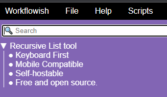

# Workflowish
`acenturyandabit`'s personal task management app. Basically a recursive list implementation (think Workflowy), but self-hostable, scriptable, and keyboard-first.

[https://acenturyandabit.github.io/workflowish/]

## Current Features
- A to-do list, with infinitely nestable, collapsible bullet points.
    - Elaborate each task with further levels of detail
- Keyboard-first nagivation
    - Work fast. No more dialogs and buttons - just use your keyboard for everything, from entering new tasks to entering metadata.
- Save source options:
    - Localstorage save: Keep your data on your own device.
    - HTTP save: GET/POST your JSONified data to any server; one possible implementation included.
- A scripting engine, to automate item renaming, addition of metadata, etc.
- Symlinks, so an item can appear in multiple places at once.

## Future features
See docs/versions.md.

## How to use 
1. Clone this repository.
2. `npm install .`
3. `npm run`
4. Follow the URL in your browser.

## Self hosting 
1. Clone this repository
2. `npm run build`
3. `npm run start-backend` opens up on port 5174 by default
3. `npm run start`
4. Follow the URL in your browser.

## Developing
See [DEVELOPERS.md].
